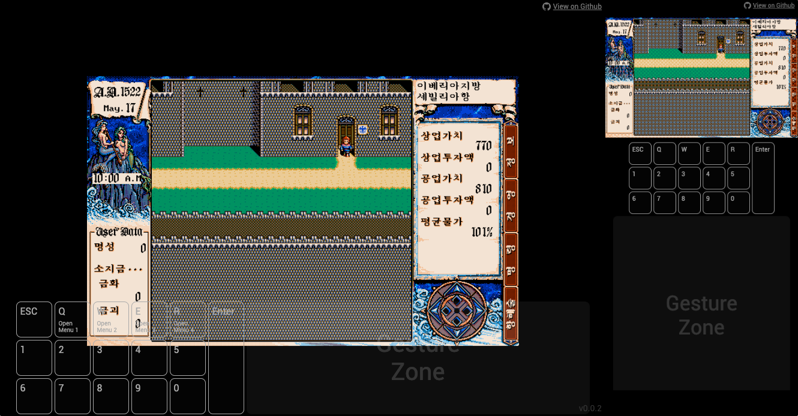

# Uncharted Water 2 for Web

  

## 소개

대항해시대 오리진의 소식을 듣고 복습겸 대항해시대2를 플레이하려고 했습니다. 시간이 많이 흘러, 컴퓨터 환경이 많이 변하였습니다.
도스 환경을 구축하는 프로그램도 원활하게 동작하지 않고, 키보드는 텐키리스를 사용해서 항해할 때 조작도 복잡하였습니다.

저 같은 사람이 분명히 많을 거 같아 대항해시대2(한글판)를 웹에서 할 수 있도록 작업하였습니다.

하루 빨리 [대항해시대 오리진](https://namu.wiki/w/%EB%8C%80%ED%95%AD%ED%95%B4%EC%8B%9C%EB%8C%80%20%EC%98%A4%EB%A6%AC%EC%A7%84)이 나오길 기원하며..

## 사용법

 - 공통
   - 게임내 저장파일은 브라우저 자체(IndexedDB)에 저장됩니다. 브라우저를 종료해도 저장파일이 계속 남아있습니다.
 - 데스크탑 + 풀키보드 배열을 사용하는 경우
   - 오리지날 키매핑으로 게임 진행이 가능합니다.
 - 데스크탑 + 텐키리스 배열을 사용하는 경우
   - 항해시 방향키를 사용할 수 있습니다.
   - `Q`, `W`, `E`, `R` 키를 이용하여 메뉴를 활성화 할 수 있습니다.
 - 모바일의 경우
   - 가상 키패드를 활용해서 게임을 진행할 수 있습니다.
 - 모드 추가
   - [에르네스트 모드 v1.11](https://cafe.naver.com/daehangs/71466) 추가

## 실행

**윈도우 익스플로러**는 지원하지 않습니다. 반드시 [크롬](https://www.google.com/chrome/)이나, [파이어폭스](https://www.mozilla.org/ko/firefox/new/),
또는, 모바일 브라우저에서 실행해주시기 바랍니다.

**[게임 시작하기](http://unchartedwater2.wani.kr)**

## 이슈보고하기

게임 중 버그나 개선할 사항이 있다면 [이슈](https://github.com/wan2land/unchartedwater2/issues)에 작성해주세요. 시간 날 때 천천히 해결해놓겠습니다.
